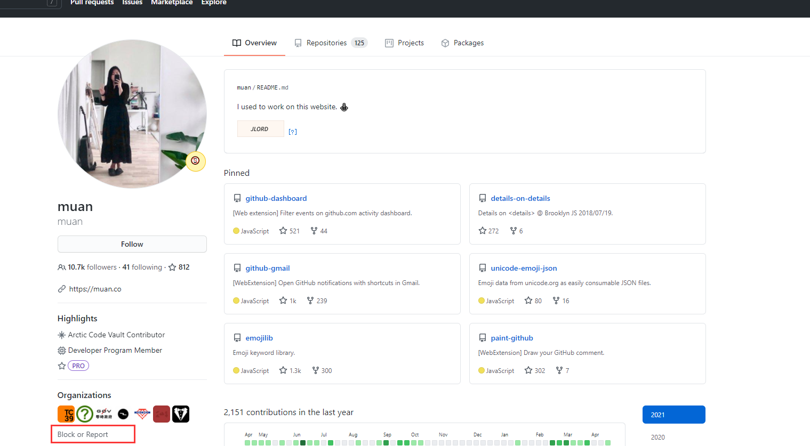
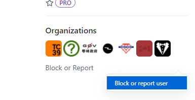
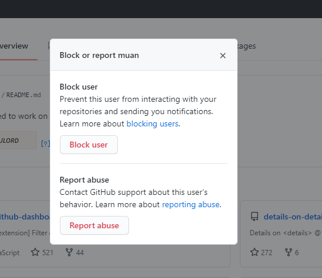
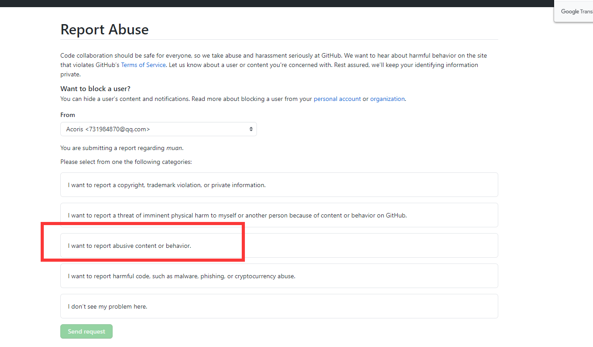
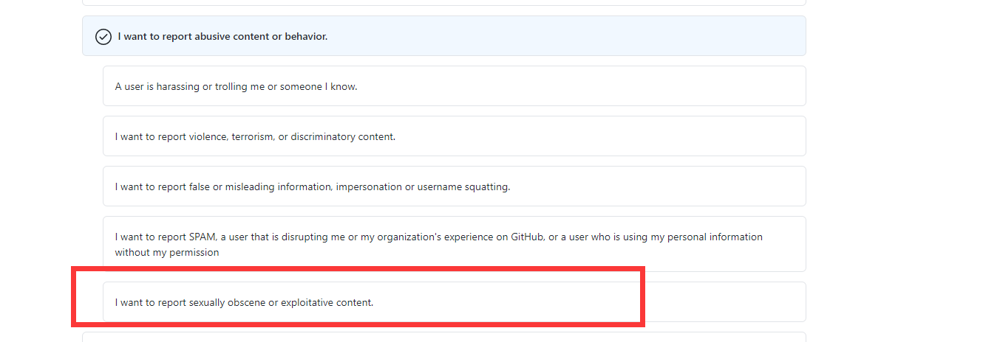
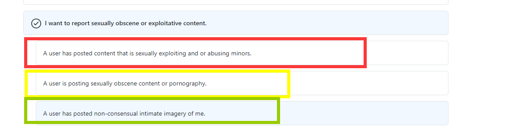

<h1 align="center">🤲Github不是Pornhub</h1>

## 起因

最近在摸鱼的时候，发现Github已经被国人老哥开发出了新的玩法，已经开发成色情内容的仓库了。众所周知，Pornhub世界上最大的成人色情网站，有些东西你可以在Twitter、Pornhub之类的地方发布，但是不要在这个推崇开源贡献的地方存放色情内容。国内对Github的封锁已经很严重了，不要再让这种封锁变得更加严重，GFW的污染还有更强的手段。

## 反思

## 举报方式

### 第一步

找到项目的所有者，单击进入用户的信息页，在信息页左边栏的下方会有 Block Or Report 按钮，因为自己信息页看不到举报自己的按钮，所以找了一个大佬的，多有冒犯，还望海涵。

这时候会弹出一个菜单，继续单击就好了

### 第二步

单击 Block or report user 菜单之后，就会弹出下面的弹窗，选择最后一个`Report abuse`按钮

选择红框圈出的选项，这时候会延伸出一些选项，请选择最后一个，

这时候还会弹出进一步的勾选，这里三个选项选哪个都行，我解释一下：

* 这个用户发布了性剥削和虐待未成年人的内容。
* 用户正在发布色情内容或色情内容。
* 一个用户贴出了我未经同意的亲密照片。

大家根据自己的判断选择对应的选项即可。

